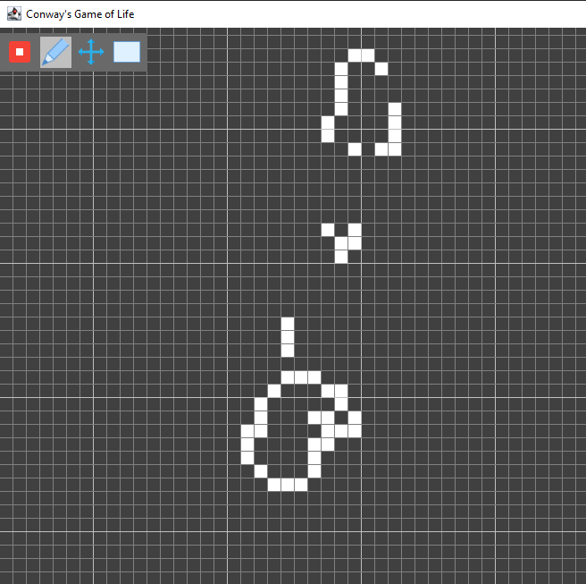

# Conway's Game of Life, in Java!

### Warning: This is an old project of mine, so some code might be messy.
### Warning 2: This implementation is really laggy, and may crash/slow down your computer significantly!

Thanks to https://github.com/Kangz/java-conway/tree/master/life/hashlife for the HashLife implementation.

## How to use
Run `Main.java` to play. On the top left of the screen is a draw tool (to toggle cells), a move tool (to move the
camera), and a drag tool (which can be used to drag over cells, but does nothing else). Pressing the play button and
stop button will start/stop the simulation, and drawing can occur during the playing state (the game will automatically
pause).
